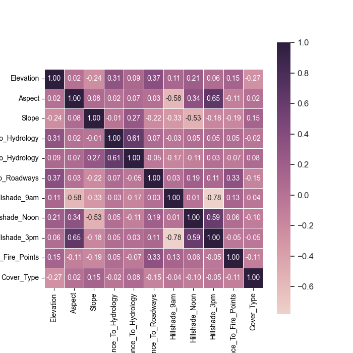
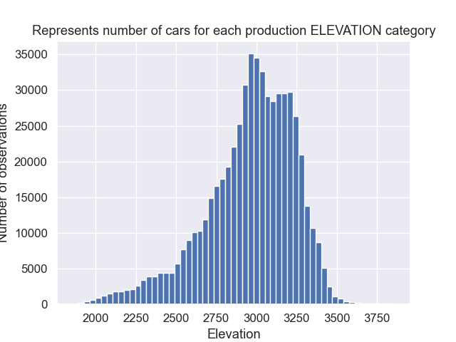
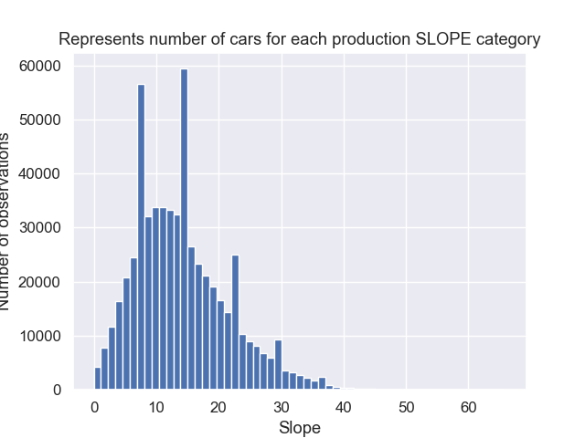
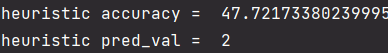
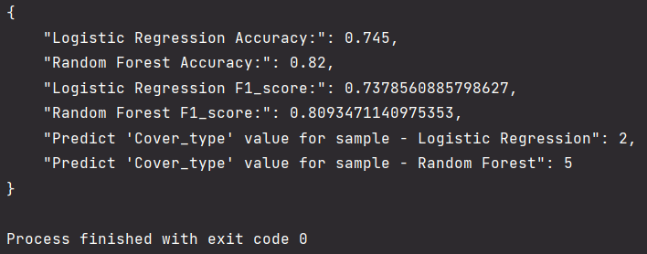
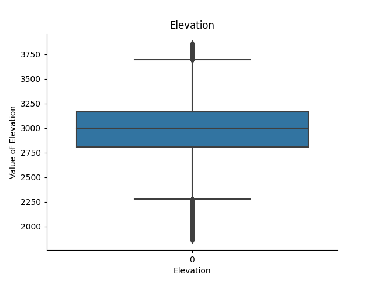
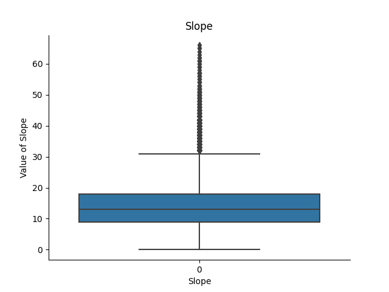
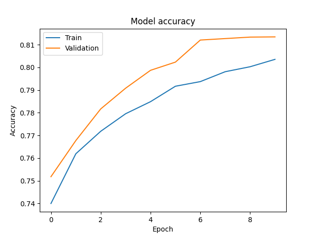
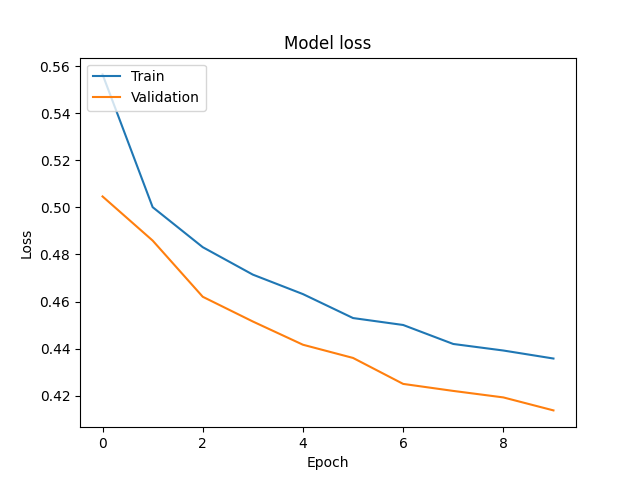

# OpenX_ML_Intern
## Intro
The following work is part of recruitment process at OpenX for the position of Machine Learning Intern.
Main task was composed of several steps:
1. Implementing a very simple heuristic that will classify the data (doesn't need to be accurate).
2. Implementing two simple Machine Learning models, based on Scikit-learn library.
3. Implementing a neural network that will classify the data, based on TensorFlow library.
Also creating a function that will find a good set of hyperparameters for the NN 
and plotting training curves for the best hyperparameters.
4. Evaluating models - plots or metrics.
5. Creating a very simple REST API that will serve models; it should allow users to choose a model
and take all necessary input features and return a prediction.
6. (Optional) Creating a Docker container image to serve the REST API.
<br>
Source of data: https://archive.ics.uci.edu/ml/datasets/Covertype  
Data was published by Colorado State University in the USA.  

Tech stack:
- scikit-learn
- tensorflow/keras
- seaborn
- matplotlib
- pandas
- numpy
- flask
- docker
- pickle

To install one of the above:
```
pip install <PACKAGE_NAME>
```
And to check version:
```
pip show <PACKAGE_NAME>
```

## Description
NOTE: not all functionalities were included into REST API functionality. **__REST API returns only metrics and predicted value__**
for inserted sample. Plots, hyperparameters and other stuff required in the content of the task is implemented but to see and use that
functionalities you need to uncomment drivers below code in every file of each model: **ann_model.py**, **two_ml_models.py**, 
**simple_heuristic.py**. After that just interpret and later compile every file separately.


### Dataset
Dataset is being stored as **covtype.data** file, already pre-processed, ready to work with.
Describe types of forest cover - divided into 7 categories. Beyond that there are also 54 columns
describing cartographic variables.
Exact description can be found in **covtype.info** file attached to project, can be
also found at source path.
<br>
<br>
Basically dataset was downloaded and unpacked from archive, then loaded as **pandas** dataframe.
Every model loads data separately from others. In some cases I cut the rows of dataset to reduce time
of compiling and be able to work more quickly and efficiently - dataset contains huge numbers of indexes,
more than 500k (Hardware limitations).
### Heuristic Algorithm
The implementation is located in the file **simple_heuristic_algorithm.py**. 
According to definition, a heuristic algorithm is an algorithm that does not guarantee finding the optimal solution. 
It is used in problems where we want to find an approximation of the solution or the computational complexity 
of such a problem is very high (NP-complexity). The algorithm was written based on trial and error method, 
empirical approach, and adjusting individual conditions to obtained results. 
The advantage of such an algorithm is its short execution time.  

The logic within the if and elif statements compares the values of certain columns in the input row against predefined
threshold values, and if the conditions are met, the method returns a corresponding integer prediction value.
Logical expressions have been defined based on, among others, histograms and correlation matrices.


Correlation matrix of picked labels:  
<p align="center">

</p>  

Example histograms made:  
* Elevation:  
 

* Slope:  
 


The obtained metric value of **accuracy** is **47%**.
And predicted value is **2** for sample:
```
sample_row = pd.Series({
    'Elevation': 2800,
    'Slope': 12,
    'Aspect': 220,
    'Hillshade_Noon': 220,
    'Wilderness_Area_3': 1,
    'Horizontal_Distance_To_Hydrology': 120,
    'Hillshade_9am': 160
})
```
<p align="center">

</p>  

### Two Scikit-Learn classification algorithms
In this task, I chose two machine learning algorithms used for data classification, namely logistic regression and random forest, both of which are located in the file two_ml_models.py.
I have previously tested other algorithms such as Naive-Bayes or SVM, however, LR and RF proved to be better.
The data has been scaled to standardize the feature values, thereby avoiding the influence of different measurement units on the analysis results.
I used StandardScaler
```
self.scaler = StandardScaler()
self.scaler.fit(self.X_train)
self.X_train = self.scaler.transform(self.X_train)
self.X_test = self.scaler.transform(self.X_test)
```
Which works as follows:  
1. Computes the mean and standard deviation for each column of the input data.
2. For each value in each column, it calculates the value (value-mean)/standard deviation.
3. Returns the normalized data.

I've also used sample:
```
sample_pred = [
    2596, 51, 3, 258, 0, 510, 221, 232, 148, 6279,
    1, 0, 0, 0, 0, 0, 0, 0, 0, 0, 0, 0, 0, 0, 0,
    0, 0, 0, 0, 0, 0, 0, 0, 0, 0, 0, 0, 0, 0, 0,
    0, 0, 1, 0, 0, 0, 0, 0, 0, 0, 0, 0, 0, 0
]
```
Which predicted value with accuracy and f1_score:  
<p align="center">

</p>  

### TensorFlow neural network
The neural network architecture consists of three layers:
1. Dense layer with hidden_layer_size units and the specified activation function. 
It takes an input shape of self.X_train.shape[1] which corresponds to the number of features in the training data.
2. Dropout layer that randomly drops out a specified dropout_rate fraction of the input units during training to reduce overfitting.
3. Another dense layer with 7 units and a softmax activation function. This layer outputs the probability distribution over the 7 output classes.

In addition to scaling, as before, I performed outlier detection using the z-score or IQR method.
Z-score method is used to identify and remove any outliers from the dataset. The z-score is calculated by subtracting 
the mean of the data from each data point, and then dividing by the standard deviation. This gives a measure of 
how many standard deviations a data point is from the mean of the dataset. Next, a threshold value is set. 
In this case, it is set to 3, which means that any data point whose z-score is greater than 3 will be considered 
an outlier and be removed right after.

And IQR method also is could be used to remove outliers. Firstly I calculate the first quartile (Q1) and the third 
quartile (Q3) of the data. Secondly I conduct calculation of the IQR as the difference between Q3 and Q1, that is, IQR = Q3 - Q1.
Next I choose the lower cut-off threshold as Q1 - 1.5 * IQR and the upper cut-off threshold as Q3 + 1.5 * IQR.
Finally I remove values from the data that are less than the lower cut-off threshold or greater than the upper cut-off threshold.

```
def outliers(self):
    # # Interquartile Range (IQR)
    # Q1 = self.data.quantile(0.25)
    # Q3 = self.data.quantile(0.75)
    # IQR = Q3 - Q1
    # data = self.data[~((self.data < (Q1 - 1.5 * IQR)) | (self.data > (Q3 + 1.5 * IQR))).any(axis=1)]

    # Calculate the z-scores of each column - measure that represents the number of standard deviations a data point is from the mean of the dataset
    z_scores = (self.data - self.data.mean()) / self.data.std()
    # Set the threshold for the z-score
    threshold = 3
    # Remove any rows where the z-score is greater than the threshold
    self.data = self.data[(np.abs(z_scores) < threshold).all(axis=1)]
```
Example boxplots made:  
* Elevation:  
 

* Slope:  
 

At the end I have implemented function which performs hyperparameter tuning for NN model 
using random search cross-validation - get_hyperparameters().
So I have declared a dictionary param_grid to specify the hyperparameters to be tuned and their possible values:
```
param_grid = {
    'hidden_layer_size': [64, 128, 256],
    'activation': ['relu', 'sigmoid'],
    'optimizer': ['adam', 'sgd'],
    'dropout_rate': [0.1, 0.2, 0.3],
    'batch_size': [32, 64, 128],
    'epochs': [5, 10, 20]
 }
```
At the end the RandomizedSearchCV function performs a randomized search over the dictionary param_grid 
to find the best combination of hyperparameters for the neural network model.

Plots training curves for the best hyperparameters:
 
 
Very good outcomes. The higher the value of accuracy the lower the loss.
### Evaluation of models


### REST API
Rest API is using Flask, I have made simple api_driver.py file to handle api requestes which are being served by
request_driver.py. It could also be send for instance from Postman. 
Example use case:


### Docker


emote: error: File serialized_files/model_heuristic.pkl is 487.61 MB; this exceeds GitHub's file size limit of 100.00 MB        
remote: error: File serialized_files/model_NN.pkl is 243.80 MB; this exceeds GitHub's file size limit of 100.00 MB